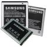

<h1 align="center">
   SMARTPHONE MANAGEMENT SYSTEM 
</h1>
<h2 align="left">Introduction</h2>
Smartphone is one of the widely used technology in the world. Smartphones have brand, pricing, features and different function. So to manage the smartphone, smartphone management project is created. It manages smartphone by different branding, different price segment, and different highlighting features(specialty). This creates a easy search of smartphone for a smartphone buyer
<h2 align="left">Screen short of main page of project:</h2>

<h2 align="left">Functions of the calculator</h2>
This mathematical calculater can perform these functions:

* Addition
* Subtraction
* Multiplication

